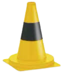

<!-- PROJECT LOGO -->
<br />
<p align="center">
  <a href="https://github.com/lukaszmichalskii/camera-perception">
    
  </a>
  <h3 align="center">System Manual</h3>
</p>


--------------------------------------------------------------------------------

<!-- TABLE OF CONTENTS -->
## Table of Contents
- [More About Cones Detection](#more-about-cones-detection)
  - [Formula Student Driverless](#formula-student-driverless)
  - [Deep Neural Network](#deep-neural-network)
- [Installation](#installation)
  - [Prerequisites](#prerequisites)
  - [Get the Cones Detection source](#get-the-cones-detection-source)
  - [Install Dependencies](#install-dependencies)
    - [Notes](#install-cuda-pytorch)

- [Getting Started](#getting-started)
- [License](#license)


## More About Cones Detection
Cones Detection is an application that provides a standalone interface to the cone detection model used in
a computer vision system working on an autonomous Formula Student car. 

### Formula Student Driverless
In Formula Student Driverless competitions, there are static and dynamic disciplines. The static
disciplines are focused on rating the car’s design, the documentation of each of the car’s systems, and
the management of the team. In dynamic disciplines, the physical and autonomous capabilities of the
car are tested. In all dynamic disciplines, the car is placed on a track, marked by four types of traffic
cones
<p align="center"></p>

There are four different dynamic disciplines; there is Acceleration, Skid-pad, Trackdrive, and Autocross.
In the acceleration dynamic event, the car has to drive through a straight track as fast as possible.
The acceleration discipline is designed to test the car’s speed capabilities as well as its ability to steer
in a stable way to keep a straight direction. In the skid-pad dynamic event, the car has to drive in 2
an eight-shaped circuit. 

<p align="center"></p>


The car first drives two laps on the right side of the track and then transitions and drives two laps on the left side after which it exits the track. The skidpad
discipline tests the ability of the autonomous system to correctly track the stage the car is in and execute
the following transitions. The trackdrive and autocross dynamic disciplines are similar to each other.
They both consist of driving in a closed–loop unknown track of length up to 1 km. The difference is that
in the autocross discipline, the car has to drive only a single lap, while in the trackdrive the car drives
10 laps. By measuring only a single lap time in the autocross, the focus is put on the car’s ability to
drive through a track it has never seen before, while in the trackdrive discipline the focus is on the car’s
ability to adapt to the track and optimize its driving throughout the 10 lap drive.


### Deep Neural Network

DNN for cones detection using the state-of-the-art [YOLO (*You Only Look Once*)](https://github.com/ultralytics/ultralytics) model. 
Training procedure was made on the [FSOCO (Formula Student Objects in Context)]() dataset that is publicly available as of August 2022, and on
recordings gathered on PWR Racing Team car tests, annotated using [Computer Vision Annotation Tool (CVAT)](https://github.com/opencv/cvat).

DNN model weights are available for download here: [weights.pt](https://github.com/lukaszmichalskii/camera-perception/raw/master/docs/yolo/weights.pt)


## Installation

### Prerequisites
If you are installing from source, you will need:
- Python 3.8 or later (for Linux, Python 3.8.1+ is needed)

If you want to compile with CUDA support, install the following (note that CUDA is not supported on macOS)
- [NVIDIA CUDA](https://developer.nvidia.com/cuda-downloads) 11.0 or above
- [NVIDIA cuDNN](https://developer.nvidia.com/cudnn) v7 or above
- [Compiler](https://gist.github.com/ax3l/9489132) compatible with CUDA

Note: You could refer to the [cuDNN Support Matrix](https://docs.nvidia.com/deeplearning/cudnn/pdf/cuDNN-Support-Matrix.pdf) for cuDNN versions with the various supported CUDA, CUDA driver and NVIDIA hardware

If you want to disable CUDA support, export the environment variable `USE_CUDA=0`.
Other potentially useful environment variables may be found in `main.py`.

### Get the Cones Detection source
```bash
git clone https://github.com/lukaszmichalskii/camera-perception.git
cd camera-perception
# **** OPTIONAL: virtual environment for Python setup ****
python3 -m virtualenv venv
source venv/bin/activate
# **** END OPTIONAL ****
```

### Install Dependencies
```bash
python3 -m pip install -r build_requirements.txt
```


#### Notes
Default `ultralytics` installation detects compute platform for PyTorch to check system
if all dependencies are installed properly:
```bash
python3 sys_check.py
```

> _Aside:_ You may end up with incorrect CPU based PyTorch installation caused by ultralytics does not detect CUDA like:
>
> ```plaintext
> Ultralytics YOLOv8.0.97 🚀 Python-3.8.10 torch-1.9.0+cpu CPU
> Setup complete ✅ (24 CPUs, 31.2 GB RAM, 35.3/91.1 GB disk)
> CUDA is not available. PyTorch CPU 1.9.0 will be used.
> ```
> or PyTorch detects CUDA but does not utilize it:
> ```plaintext
> Ultralytics YOLOv8.0.97 🚀 Python-3.8.10 torch-1.9.0+cpu CPU
> Setup complete ✅ (24 CPUs, 31.2 GB RAM, 35.3/91.1 GB disk)
> CUDA is available but PyTorch CPU 1.9.0 is used. Check environment configuration for better performance.
>``` 
>
> If you have CUDA enabled just follow instruction from [PyTorch Get Started](https://pytorch.org/get-started/locally/) and override installed PyTorch version.
> 
> _Aside:_ If you are using CUDA but PyTorch does not detect it make sure steps from `Prerequisites`
>  was done correctly: 
> 
> ```plaintext
> Ultralytics YOLOv8.0.72 🚀 Python-3.8.10 torch-2.0.0+cu117 CUDA:0 (NVIDIA GeForce RTX 3060, 12036MiB)
> Setup complete ✅ (24 CPUs, 31.2 GB RAM, 35.3/91.1 GB disk)
> CUDA is not available but PyTorch CU 2.0.0 is installed. Check environment configuration for conflicted packages.
>```
> 


## Getting Started

Cones Detection can be run in two modes:
* detect cones on MP4 video recording
* standalone cones inference from image

Example run with provided resources:
```bash
# image mode
python3 src/detect.py --image docs/yolo/inference.jpg
# video mode
python3 src/detect.py --video docs/yolo/autocross.mp4
```

#### Save results
If you want to save results from run enable `--save` flag when running application. To specify output directory
use `--output <path_to_dir>` option (default save to `results/` directory).
```bash
# save results from image inference
python3 src/detect.py --image docs/yolo/inference.jpg --save
```

> _Aside:_ Saving each frame in video mode is possible but generate huge output:
>
> ```plaintext
> python3 src/detect.py --video docs/yolo/autocross.mp4 --save --output <path_to_dir>
> ```

#### Adjust running options
Other options can be set via environment variables:

| Variable   | Description                                                                    | Default  |
|------------|--------------------------------------------------------------------------------|----------|
| CONFIDENCE | Model detection confidence threshold                                           | 0.7      |
| RESOLUTION | Frame or image resolution, for better performance consider smaller resolutions | 1280x720 |


## License
Cones Detection has a GNU license, as found in the [LICENSE](https://github.com/lukaszmichalskii/camera-perception/blob/master/LICENSE) file.
