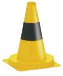

<!-- PROJECT SHIELDS -->
<!--
*** I'm using markdown "reference style" links for readability.
*** Reference links are enclosed in brackets [ ] instead of parentheses ( ).
*** See the bottom of this document for the declaration of the reference variables
*** for contributors-url, forks-url, etc. This is an optional, concise syntax you may use.
*** https://www.markdownguide.org/basic-syntax/#reference-style-links
-->

[![CI][ci-shield]][ci-url]

<!-- PROJECT LOGO -->
 

  

  <h3 align="center">Camera Perception</h3>

  

    Cones detection module based on YOLOv8 algorithm
     
    <a href="https://github.com/lukaszmichalskii/camera-perception"><strong>Explore the docs »</strong></a>
     
     
    <a href="https://github.com/lukaszmichalskii/camera-perception/blob/master/docs/resources/demo.jpg">View Demo</a>
    ·
    <a href="https://github.com/lukaszmichalskii/camera-perception/issues">Report Bug</a>
    ·
    <a href="https://github.com/lukaszmichalskii/camera-perception/issues">Request Feature</a>
  

<!-- TABLE OF CONTENTS -->
## Table of Contents

* [About the Project](#about-the-project)
* [Backlog](#backlog)
* [Contact](#contact)

<!-- ABOUT THE PROJECT -->
## About The Project

Cones detection algorithm used in the camera vision system
of an autonomous formula, participating in the Formula Student Driverless
competition. Formula Student Driverless is a worldwide university competition, each year teams compete
in building an autonomous formula. The project is proof of concept of cones detection module for
the currently developed perception system. The positions of the cones seen through the camera are then
used by the car’s autonomous system to drive.

<!-- BACKLOG -->
## Backlog

See the [Issues](https://github.com/lukaszmichalskii/camera-perception/issues) for a list of proposed features (and known issues).

<!-- CONTACT -->
## Contact

Project: [https://github.com/lukaszmichalskii/camera-perception](https://github.com/lukaszmichalskii/camera-perception)

| Author       | Email        |
|--------------|--------------|
| Łukasz Michalski | 261118@student.pwr.edu.pl |
| Andrzej Sołtysik | 259191@student.pwr.edu.pl |

<!-- MARKDOWN LINKS & IMAGES -->
<!-- https://www.markdownguide.org/basic-syntax/#reference-style-links -->
[contributors-shield]: https://img.shields.io/github/contributors/lukaszmichalskii/repo.svg?style=flat-square
[contributors-url]: https://github.com/lukaszmichalskii/Samsung-KPZ/graphs/contributors
[forks-shield]: https://img.shields.io/github/forks/lukaszmichalskii/repo.svg?style=flat-square
[forks-url]: https://github.com/lukaszmichalskii/Samsung-KPZ/network/members
[stars-shield]: https://img.shields.io/github/stars/lukaszmichalskii/repo.svg?style=flat-square
[stars-url]: https://github.com/lukaszmichalskii/Samsung-KPZ/stargazers
[issues-shield]: https://img.shields.io/github/issues/lukaszmichalskii/repo.svg?style=flat-square
[issues-url]: https://github.com/lukaszmichalskii/Samsung-KPZ/issues
[license-shield]: https://img.shields.io/badge/license-MIT-orange
[linkedin-shield]: https://img.shields.io/badge/-LinkedIn-black.svg?style=flat-square&logo=linkedin&colorB=555
[linkedin-url]: https://www.linkedin.com/in/lukasz-michalski-823106202/
[jira-shield]: https://img.shields.io/badge/Jira-Join-blue
[ci-shield]: https://img.shields.io/badge/CI-passing-green
[ci-url]: https://github.com/lukaszmichalskii/camera-perception/actions/